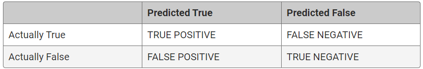
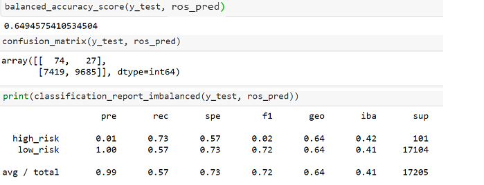
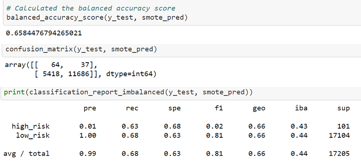
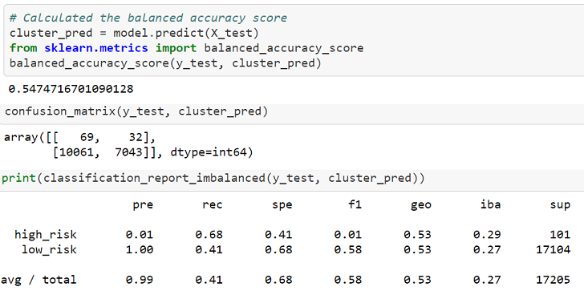
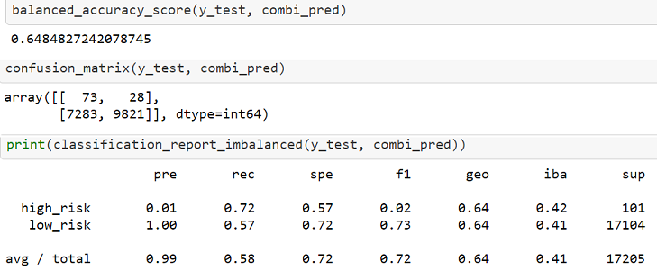
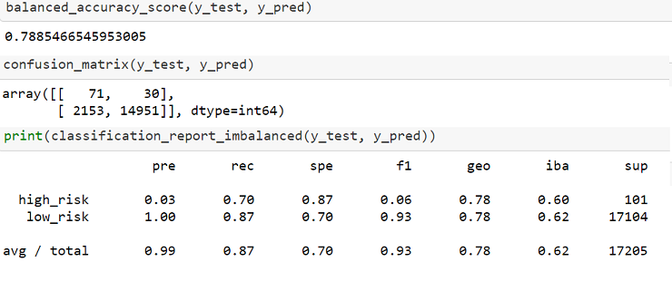
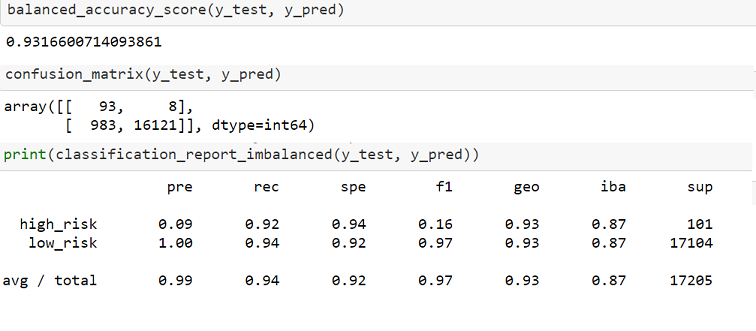

# Credit Risk Analysis

## Purpose

The purpose of this analysis is to use an assortment of supervised machine learning techniques to create models that predict the credit risk of an applicant using data from LendingClub It tests 2 methods of oversampling, a method of undersampling, and a combinatorial approach to assess their success and accuracy in working with an imbalanced dataset. Then, two ensemble models are compared to observe potential for bias reduction. 

## Results 

Each model was evaluated by measuring the balanced accuracy score, viewing the confusion matrix, and analyzing the imbalanced classification report.  The confusion matrix displays the predictions, indicating how many were true positive and negatives, as well as false positives and negatives. Below is an example image, showing what each cell in the matrix indicates:

The imbalanced classification report compiles several metrics, including precision, recall, specificity, the f1 score, and geometric mean.  For the purposes of our analysis, we are ignoring the geometric mean and specificity, and focusing on precision, recall, and f1 scores. Precision is a measure of reliability - how frequently the model correctly predicts an outcome (AKA True Positive / (True Positive + False Positive)). Recall, or sensitivity, is slightly different; it measures how many outcomes were correctly predicted (AKA True Positive / (True Positive + False Negative)). The F1 score is also known as the harmonic mean, and it is a combined measure for precision and sensitivity. For this measure, a smaller score indicates a larger amount of imbalance in the data. The balanced accuracy score in sklearn, used for highly imbalanced data, is the average of recall obtained on each class. 

In general, there is a definite trade off between precision and sensitivity, and which to prioritize largely depends on the use case. In the case of loan approval, it would be much better for the lender to have false positives (applications labeled as high risk when they are actually low-risk) than to have many false negatives  (applications that are high-risk, but labeled as low-risk), thus sensitivity is the primary necessity. Because this dataset is highly imbalanced, with many more low-risk applications than high-risk applications, the expectation is that models are more likely to be precise than to be sensitive. 

### Oversampling

In oversampling, the algorithm attempts to account for class imbalance by increasing the number of points in the minority class. 

#### Naive Random Oversampling

In random oversampling, instances of the minority class are randomly selected and added to the training set until the majority and minority are balanced. 

- The confusion matrix indicates that of the true values in the sample, 74 of them were correctly predicted as positive, and 27 of them were incorrectly predicted to be negative. In our case, this means that there were 101 cases of high-risk loans, and 74 of them were correctly identified as such. However, of the 17104 low-risk cases, only 9,685 were correctly identified as low-risk.  Thus, while the model is highly precise, it is not very sensitive at all, with about 57% of outcomes correctly predicted. 

- The balanced accuracy score, or the average of recalls for each classification, is around 65%. While higher than the imbalanced report shows, it is still not ideal when taken in context. 
- The F1 score is essentially a weighted version of the balanced accuracy score, taking into account the relative contribution of precision and recall, but not accounting for true negatives. Ideally, the F1 score is close to 1; while that is the case for the total F1, it is clear that the F1 of the high risk and low-risk classifications are quite disparate, indicating again how imbalanced our data is. 

#### SMOTE

In the Synthetic Minority Oversampling Technique (SMOTE), new instances of the minority class are interpolated from existing data points. This method, while it reduces some risks associated with oversampling, is vulnerable to outliers.  

- The confusion matrix for this model is interesting because while it didn't perform as well in regards to positive predictions, it was much more successful in predicting negative cases. Of the 17104 low-risk cases, 11,686 were correctly classified as such. However, it only correctly predicted 64 of the 101 high-risk cases. 
- The balanced accuracy score is similar to the ROS method at around 65%
- The F1 score here is several points higher than in the ROS method, at 0.81. This is approaching satisfactory, but again the large disparity in scores between high and low risk is cause for question of the reliability of the average/total score. 

- As mentioned previously, it is more important to minimize false negatives, the number of applications labeled as low-risk when they are actually high-risk. Thus, I would probably not use this model over the ROS model, because while it was more successful at identifying low-risk applications than the ROS, it was not as effective at classifying high-risk applications. 

  

### Undersampling with the Cluster Centroids Algorithm

Undersampling is different than oversampling in that it seeks to change the number of points in the majority class, rather than the minority class. In the Cluster Centroids undersampling technique, the algorithm identifies clusters of the majority class, then generates synthetic data points ("centroids") that are representative of the clusters and uses those rather than the full data set. 

- The confusion matrix for this model indicates that of the 101 high risk cases, it correctly identified 69. However, it only correctly predicted 7043 of the low-risk cases. 
- The balanced accuracy score here is a little lower than the previous models at 55%.
- The F1 score for this technique is much lower than either of the previous two models, indicating that the data is still very imbalanced despite the applied sampling strategy. 
- This model overpredicts high risk applications, which on its surface sounds better than the alternative. The overall sensitivity for the model is much lower than either of the other two models, and the sensitivity for high-risk classification lands it squarely between SMOTE and ROS  when it  comes to correctly identifying high risk applications. However, when examined closely, the number of applications incorrectly labeled as low risk is not much different than the other two models, essentially increasing the amount of double-checking necessary to locate false positives while not providing much of a benefit with regard to false negative identification. 
- In some cases, a model like this might be somewhat ideal. For example, if a lender was looking to decrease the overall number of applications approved and was willing to pay the cost of the additional financial risk posed by the rate of false negatives. 

### Combination Sampling with SMOTE-ENN

SMOTEENN combines the SMOTE oversampling technique with an undersampling technique called Edited Nearest Neighbor. Essentially, this algorithm oversamples the minority class with SMOTE, and cleans the resulting data by dropping data points that meet certain criteria. 

- The confusion matrix for this model is fairly comparable to the ROS model. It correctly identified about 72% of the high risk applications, and 57% of low risk applications. 
- The balanced accuracy score is also comparable to ROS and SMOTE at approximately 65%
- The F1 score is again comparable to the ROS model, a little lower than SMOTE. 
- This model appears to be the best of those using logistic regression. While the rate of true positive identification is ever so slightly lower than the ROS model (by one item), the true negative classification is improved by about 1%. Thus, compared to other options, SMOTEENN maximizes correct predictions while minimizing incorrect ones. 

### Ensemble Learning

Ensemble learning combines multiple models to help improve the accuracy and robustness, as well as decrease variance, of a model, thus improving overall performance. 

#### Balanced Random Forest

Balanced Random Forest uses a decision tree and randomly under-samples each bootstrap sample. Bootstrapping creates multiple samples from the same data wherein there could be multiple instances of the same observation.

- The confusion matrix for this model indicates that it correctly identified 70% of the high-risk cases and 87% of low-risk cases. This is the most sensitive of all models so far, at 87% overall, again striking a balance between maximization of correct classifications and minimization of incorrect classifications when compared to the other techniques above. 
- The balanced accuracy score for this model is about 79%.
- The F1 score is the highest of all models so far at 0.93. 

- The Balanced Random Forest model is the highest performing of all previous models. It retains approximately the same sensitivity toward high risk applications as SMOTEENN and ROS, while increasing the sensitivity of the low risk classifications as well. The high F1 score indicates that despite the dataset being highly imbalanced, the sampling technique used here (bootstrapping) has created a model based on data that is fairly balanced and which has a satisfactory ratio between precision and sensitivity.

  

#### AdaBoost

Adaboost (or Adaptive Boosting) is an iterative model in which the classifier is fit on the original dataset multiple times,  and the erroneous weights are adjusted with each iteration. 

- The confusion matrix indicates that AdaBoost appears to outperform all of the other models and techniques applied to this dataset. It shows a 92% sensitivity for high risk applications and 94% for low risk, while retaining the 99% precision that has been present across all tests. 
- The balanced accuracy score is about 93%
- The F1 score is 0.97. When observed individually, the F1 score for high risk applications is still quite low, but several points higher than any of the other models, again showing how imbalanced the dataset is. 
- The concept to which I keep returning is that of maximizing success while minimizing errors, and this model is the most effective of those tested here. It has the highest recall of any of the tests so far, when looking at each individual class as well as overall. The accuracy score and F1 scores are both very close to 1, which is desirable. 

## Summary

Out of the tested models, I would recommend AdaBoost for predicting credit risk. As mentioned above, it has the highest accuracy score and minmaxes the classifications. However, I recommend it with the caveat that <u>this model is likely overfit to our dataset</u>. The level of imbalance, while it can be accounted for, cannot be erased in an analysis. Additionally, this dataset only covered Q1 of 2019, so just that full year's data alone could shift the balance enough to make this model less effective than it currently appears.

Taking all of this into account I would consider the AdaBoost model a promising avenue for predicting credit risk, but I would not consider this model production-ready. By increasing training data and testing iterations, the model could prove to be robust against the level of imbalance in the credit risk data, but without additional testing it is not decisive. 